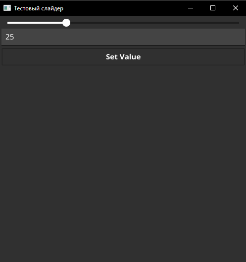

# go-slider-fyne
Application slider written in Golang. App built with [Fyne](https://fyne.io/).  
[Fyne](https://fyne.io/) is an easy-to-use UI toolkit and app API written in Go. It is designed to build applications that run on desktop and mobile devices with a single codebase.
### Overview

